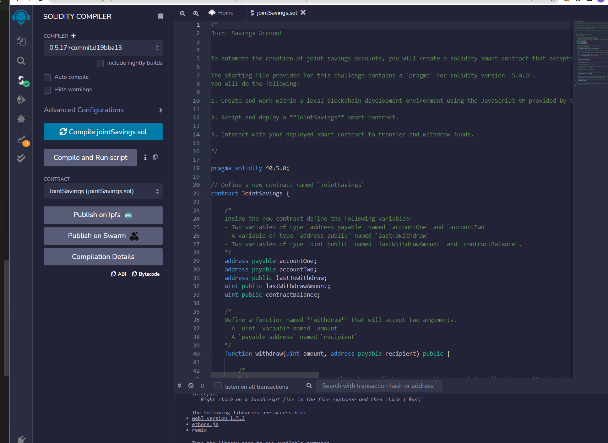
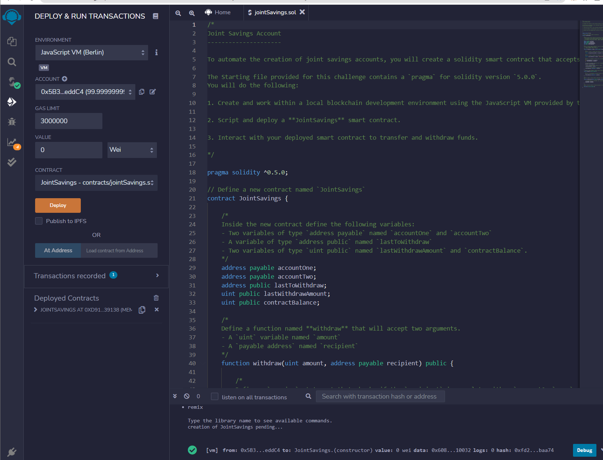
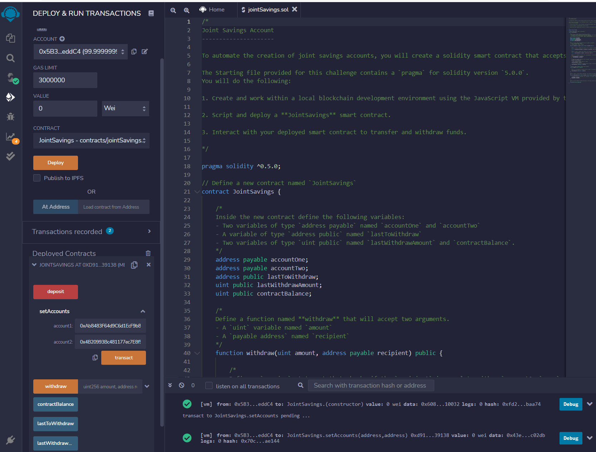
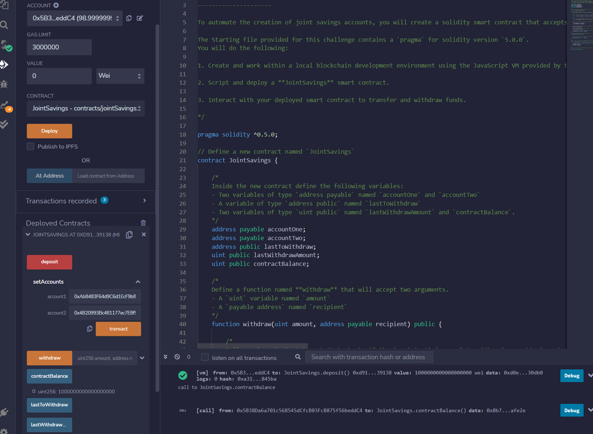
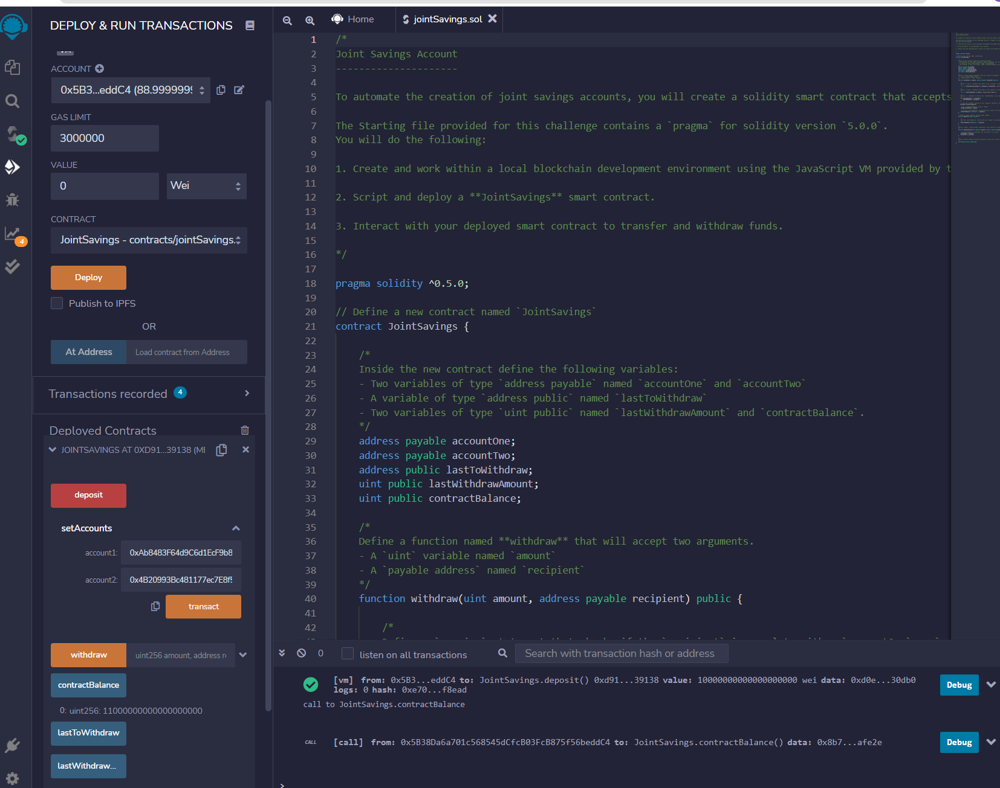
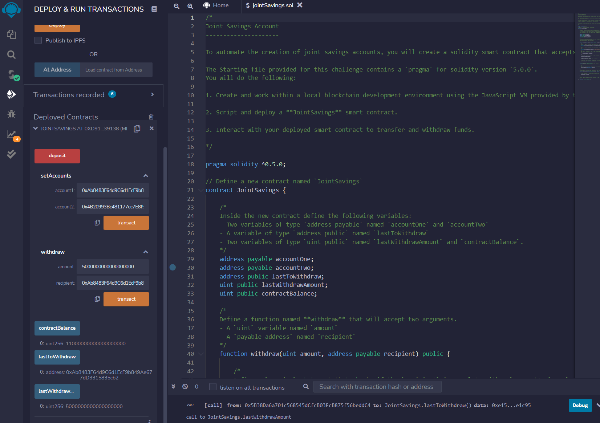
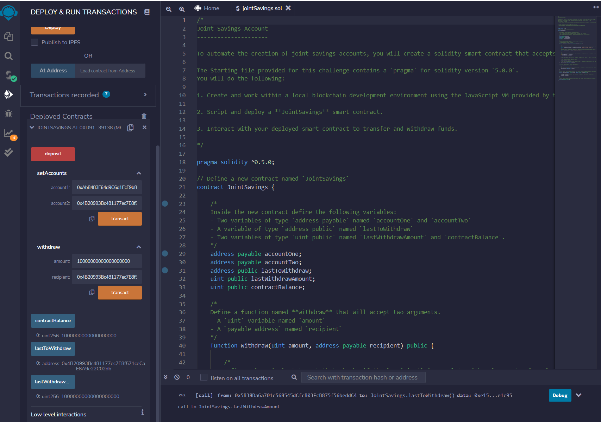

# Joint Savings Account 

In this assignment, I created a joint savings account contract in Solidity, complied and deployed the contract in the JavaScript VM, and also interact with this deployed smart contract. 

owner's address: 0x5B38Da6a701c568545dCfcB03FcB875f56beddC4

contract address: 0xd9145CCE52D386f254917e481eB44e9943F39138

account 1 address: 0xAb8483F64d9C6d1EcF9b849Ae677dD3315835cb2

account 2 address: 0x4B20993Bc481177ec7E8f571ceCaE8A9e22C02db

Complied image

Deployed image

Set Accounts

Deposit 1 Ether

Deposit 10 Ether

Deposit 5 Ether
![deposit5]](Execution_Results/deposit5.png)

Withdraw to account 1 

Withdraw to account 2
